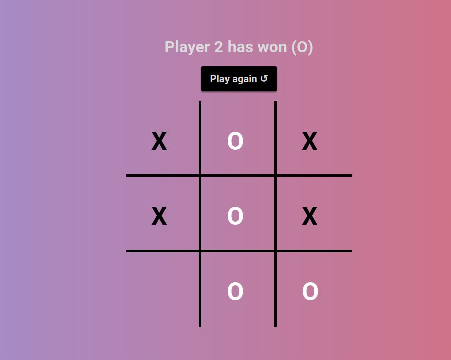

# Tic-Tac-Toe
Live demo &#128073; https://masecurity.github.io/Tic-Tac-Toe/
## What is this project about?
This project allows user's to play against each other in a game of Tic-Tac-Toe, as well as giving the option to play against a basic AI instead.This project was built
using HTML, CSS and Javascript.

## What i learned
- Factory functions (private functions and public functions).
- IIFE's.
